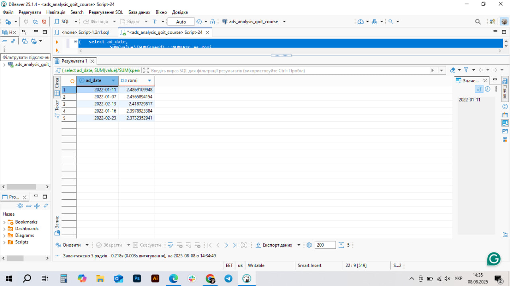

# ROMI Analysis for Facebook and Google Ads (SQL Practice)

This project is a SQL practice where I wrote a query to calculate ROMI (return on ad spend) using data from Facebook and Google Ads.

The goal was to practice:  
- Working with multiple tables,  
- Calculating key metrics,  
- Writing SQL queries that can be used in real-world analytics.

## What I Learned
-  Writing SQL with `JOIN` (Facebook: ad, campaign, adset)
-  Aggregating data: `SUM()` and `GROUP BY`
-  Calculating ROMI: `(SUM(value) / SUM(spend))`
-  Filtering: `HAVING SUM(spend) > 0`
-  Combining results: `UNION ALL`
-  Sorting: `ORDER BY` + `LIMIT 5`

## How the Query Works
The query:
1. Joins Facebook data (ads, campaigns, adsets) to get full context.
2. Calculates ROMI per day for Facebook and Google separately.
3. Combines results with `UNION ALL` and returns the top 5 highest-ROMI days.

## Example Output  

## How to Use  
1. Copy the code from `script.sql`.  
2. Run it in a SQL environment (e.g., PostgreSQL or DBeaver).  
3. Check which days had the best ad performance.

---

*Created by Kateryna Vahina— Junior Data Analyst / LinkedIn: www.linkedin.com/in/kateryna-vahina*
